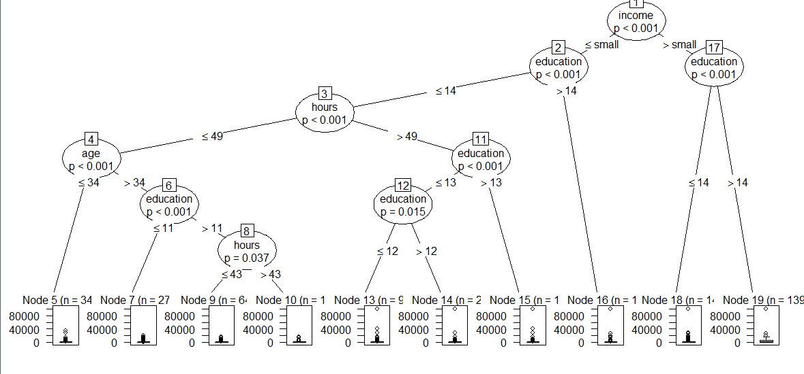
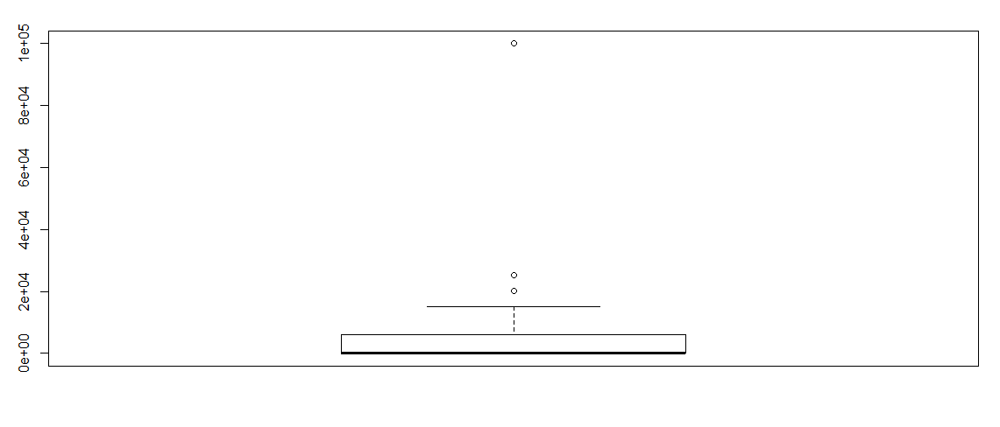
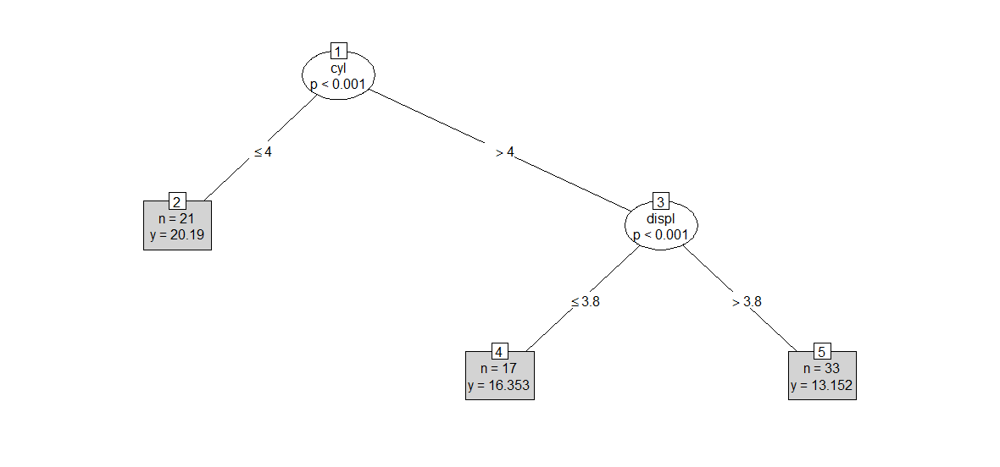
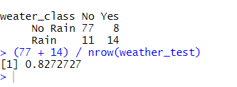

# 분류분석 연습문제

```r
#####################분류분석 연습문제 1  ####################
# ggplot2::mpg 데이터 셋
# model(모델), displ(엔진 크기) , cyl(실린더 수), drv(구동 방식)
# 종속변수 : 고속도로 주행거리(hwy)
library(ggplot2)
data(mpg)
t <-sample(1:nrow(mpg), 120)
train <- mpg[t, ]
test <- mpg[-t, ]
test$drv <- factor(test$drv)  #구동방식 범주형 변환
formula <- hwy ~ disp+cyl+drv
hwy_ctree <- ctree(formula, data=test)
plot(hwy_ctree)

분석 결과 : 엔진 크기가 작으면서 전륜구동(f)이나 후륜(r) 구동 방식인 경우 고속도로 주행거리가 가장 좋고, 
엔진 크기가 크고, 사륜구동 방식이면 실린더 수가 많은 경우 고속도로 주행거리가 적은 것으로 분석된다.
```


#### ※ 결과 값은 항상 바뀜 ( 샘플의 120개가 바뀌기 때문)


## 문제 2

```r
#####################분류분석 연습문제 2  ####################
install.packages("arules")
library(arules)
data("AdultUCI")
#성인 대상 인구 소득에 관한 설문 조사 데이터
#48,842 관측치와 15개변수
age, workclass(직업 :4개), education(교육수준: 16개), marital-status(결혼상태: 6개), occupation(직업:12개), relationship(관계: 6개), race(인종:아시아계, 백인), sex(성별), capital-gain(자본이득), capital-loss(자본손실), fnlwgt(미지의 변수), hours-per-week(주당 근무시간), native-country(국가), income(소득)

#10,000개 관측치를 샘플링해서
자본이득에 영향을 미치는 변수를 분석하기 위해 
capital-gain, hours-per-week, education-num, race, age, income 변수로만 구성된 데이터프레임을 생성한후 분류모델 생성하고 예측하시오
names(AdultUCI)
set.seed(1234)
choice <- sample(1:nrow(AdultUCI), 10000)
choice

adult.df <- AdultUCI[choice, ]
str(adult.df)

capital <- adult.df$'capital-gain'
hours <- adult.df$'hours-per-week'
education <- adult.df$'education-num'
race <- adult.df$race
age <- adult.df$age
income <- adult.df$income

adult_df <- data.frame(capital=capital, age=age , hours=hours,
    education=education, income=income)
str(adult_df)

formula <- capital ~ income+education+hours+age

adult_ctree <- ctree(formula, data=adult_df)

plot(adult_ctree)

#분석결과 : 자본이득(capital)에 가장 큰 영향을 미치는 변수는 income이고, 두번째는 education 변수이다.
수입이 많고 교육수준이 높을수록 자본이득이 많은 것으로 분석된다.


```





```r

#분류 모델의 조건에 맞는 subset 생성
adultResult <- subset(adult_df, adult_df$income=='large' &  adult_df$education > 14)
length(adultResult$education)
summary(adultResult$capital) 
boxplot(adultResult$capital)

#income이 large이고 education이 14를 초과한 경우, 
자본이득 평균은 9,241
```





### 데이터프레임 이름 바꾸는법

```R
names(abc2)

names(abc2)[13] <- c("hours_per_week")
names(abc2)[11] <- c("capital_gain")
names(abc2)[5] <- c("education_num")
```


## 문제3 : rpart, 혼돈매트릭스, 분류모델 예측


```r
############분류분석 연습문제 3 ########################
weather <- read.csv("./data/weather.csv", header=TRUE)

#RainTomorrow 컬럼을 종속변수로 
# 날씨 요인과 관련없는 Date와 RainToday컬럼을 제외한 나머지 변수를 x변수로 지정하여 분류 모델 생성하고 모델을 평가하시오

str(weather)
names(weather)
weather.df <- rpart(RainTomorrow ~ ., data=weather[, c(-1, -14)], cp=0.01) 
#X11() #?
plot(weather.df)
text(weather.df, use.n=T, cex=0.7)

#분석 결과 : 분기조건이 True이면 왼쪽으로 분류되고, False
이면 오른쪽으로 분류된다.
#rpart()함수의 cp속성값을 높이면 가지 수가 적어지고, 낮추면 가지 수가 많아진다. cp 기본값은 0.01

weather_pred <- predict(weather.df , weather)
weather_pred

#y의 범주로 코딩 변환 : Yes(0.5이상), No(0.5미만)
#rpart의 분류모델 예측치는 비 유무를 0~1사이의 확률값으로 예측하다 
# 혼돈매트릭스를 이용하여 분류정확도를 구하기 위해 범주화 코딩 변경
weather_pred2 <- ifelse(weather_pred[,2] >= 0.5, 'Yes', 'No')
table(weather_pred2, weather$RainTomorrow)

(278 + 53) / nrow(weather)
#0.9043716
```


```
########################분류분석 연습문제 4#######################
# mpg 데이터 셋을 대상으로 7:3 비율로 학습데이터와 검정데이터로 각각 샘플링한 후
각 단계별로 분류분석을 수행하시오.
조건) 변수모델링 : x변수(displ + cyl + year), y변수(cty)

단계1 : 학습데이터와 검증데이터 샘플링
단계2 : formula 생성
단계3 : 학습데이터에 분류모델 적용
단계4 : 검정데이터에 분류모델 적용 
단계5 : 분류분석 결과 시각화 
단계6 : 분류분석 결과 해설 


########################분류분석 연습문제 5##################
weather 데이터를 이용하여 다음과 같은 단계별로 분류분석을 수행하시오.
조건1) rpart() 함수 이용 분류모델 생성
조건2) 변수 모델링 :
y변수(RainTomorrow), x변수(Date와 RainToday 변수 제외한 나머지 변수)
조건3) 비가 올 확률이 50% 이상이면 ‘Yes Rain’, 50% 미만이면 ‘No Rain’으로 범주화

단계1 : 데이터 가져오기
library(rpart)
weather = read.csv("./data/weather.csv", header=TRUE)
단계2 : 데이터 샘플링 
단계3 : 분류모델 생성 
단계4 : 예측치 생성 : 검정데이터 이용 
단계5 : 예측 확률 범주화('Yes Rain', 'No Rain')
단계6 : 혼돈 행렬(confusion matrix) 생성 및 분류정확도 구하기 
```


## 문제 4 : mpg 데이터로 분류분석


```r

########################분류분석 연습문제 4#######################
# mpg 데이터 셋을 대상으로 7:3 비율로 학습데이터와 검정데이터로 각각 샘플링한 후
# 각 단계별로 분류분석을 수행하시오.
# 조건) 변수모델링 : x변수(displ + cyl + year), y변수(cty)

단계1 : 학습데이터와 검정 데이터 생성
idx <- sample(1: nrow(mpg), nrow(mpg) * 0.7)
train <- mpg[idx, ] # 학습데이터
dim(train)
test <- mpg[-idx, ] # 검정데이터
dim(test)

단계2 : formula 생성
# 도시 주행마일수 <- 실린더, 엔진크기, 제조년도 
formula <- cty ~ displ + cyl + year

단계3 : 학습데이터에 분류모델 적용
mpg_train <- ctree(formula, data=train)

단계4 : 검정데이터에 분류모델 적용
mpg_test <- ctree(formula, data=test)

단계5 : 분류분석 결과 시각화
plot(mpg_test)

단계6 : 분류분석 결과 해설
실린더가 4이하이면 21개가 분류되고, 실린더가 5이상이고, 엔진크기가 3.8이하면 
17개, 3.8을 초과한 경우 33개가 분류된다.
```


결과 :

(랜덤이라 값 바뀜)




## 문제 5 : rpart 날씨 분류분석


```r
########################분류분석 연습문제 5##################
weather 데이터를 이용하여 다음과 같은 단계별로 분류분석을 수행하시오.
조건1) rpart() 함수 이용 분류모델 생성
조건2) 변수 모델링 :
  y변수(RainTomorrow), x변수(Date와 RainToday 변수 제외한 나머지 변수)
조건3) 비가 올 확률이 50% 이상이면 ‘Yes Rain’, 50% 미만이면 ‘No Rain’으로 범주화

단계1 : 데이터 가져오기
library(rpart)
weather = read.csv("./data/weather.csv", header=TRUE)

단계2 : 데이터 샘플링
weather.df <- weather[, c(-1,-14)]
nrow(weather.df)
idx <- sample(1:nrow(weather.df), nrow(weather.df)*0.7)
weather_train <- weather.df[idx, ]
weather_test <- weather.df[-idx, ]

단계3 : 분류모델 생성
weather_model <- rpart(RainTomorrow ~ ., data = weather.df)
weather_model # Humidity 중요변수

단계4 : 예측치 생성 : 검정데이터 이용
weater_pred <- predict(weather_model, weather_test)
weater_pred

단계5 : 예측 확률 범주화('Yes Rain', 'No Rain')
weater_class <- ifelse(weater_pred[,1] >=0.5, 'No Rain', 'Rain')

단계6 : 혼돈 행렬(confusion matrix) 생성 및 분류정확도 구하기
table(weater_class, weather_test$RainTomorrow)
 
(77 + 14) / nrow(weather_test)

```


결과 : 


