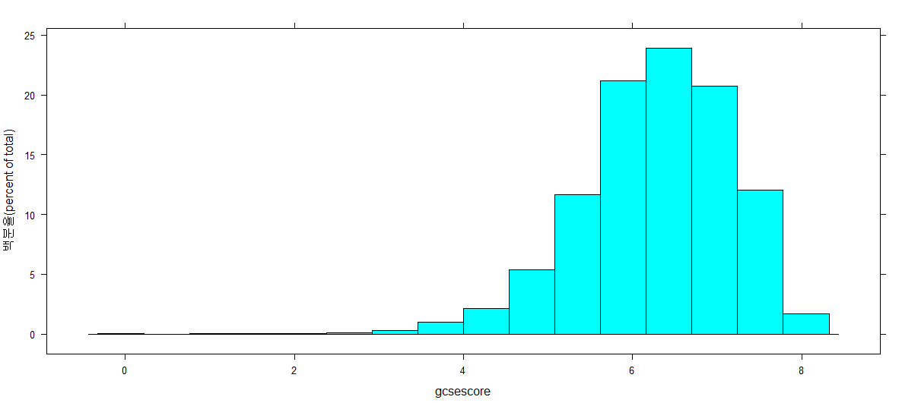
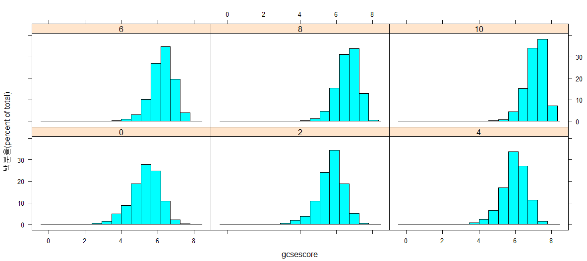
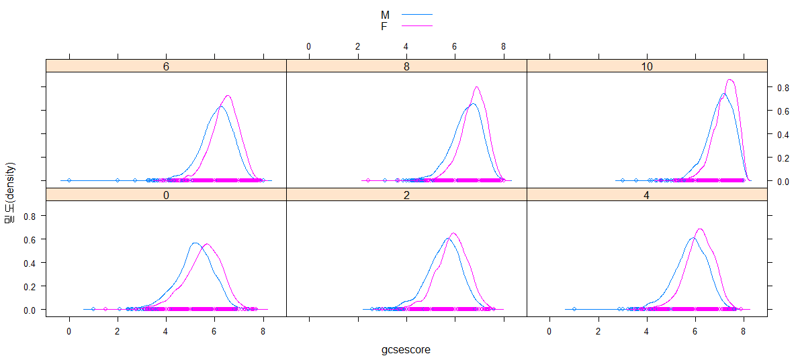
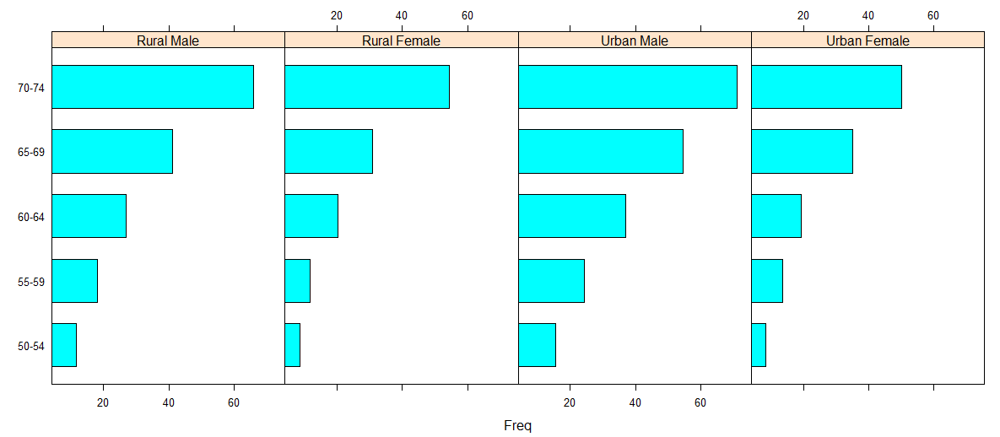
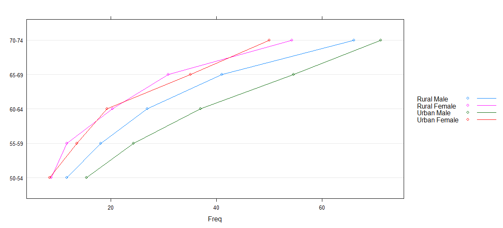
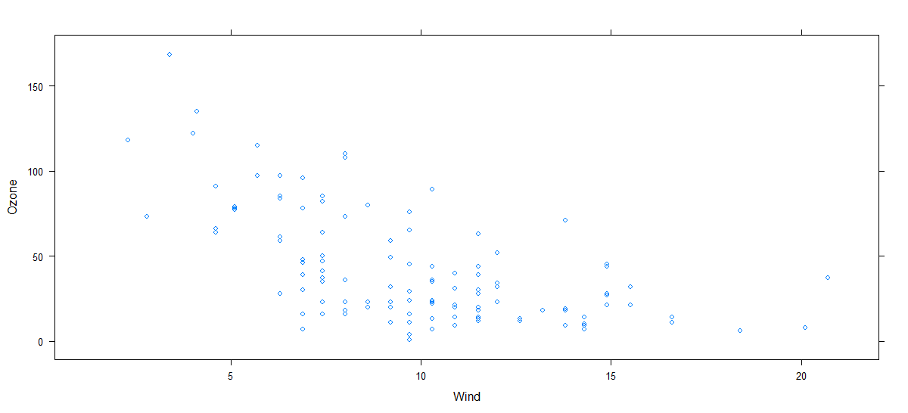
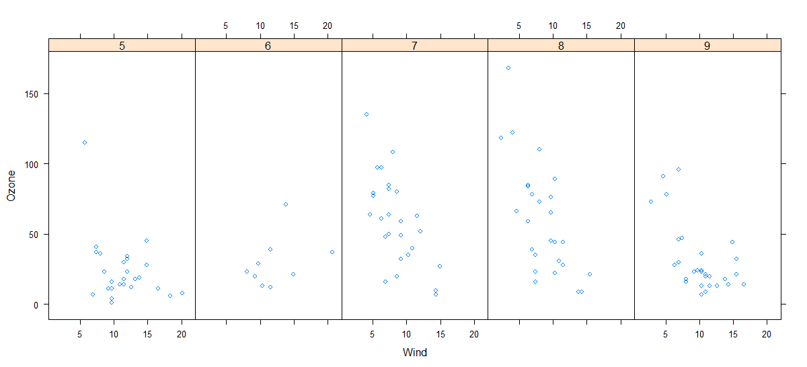

# R 고급 시각화


##### 시각화 주요 패키지 : graphics, lattice, ggplot2, ggmap

##### 이산변수 시각화 : barplot(), dotchart(), pie() 

##### 연속변수 시각화 : boxplot(), hist(), plot()


ggplot2 패키지는 기하학적 객체들(점, 선, 막대 등)에 미적특성(색상, 모양, 크기)을 적용하여 시각화하는 방법을제공


ggmap 패키지는 지도를 기반으로 위치, 영역, 시각과 공간에 따른 차이 및 변화를 다루는 공간시각화에 적합


#### lattice

- lattice 패키지는 서로 상관있는 확률적 종속변수의 시각화에 사용

- 특정 변수가 갖는 범주별로 독립된 패널을 격차(lattice)처럼 배치하여 여러 개의 변수에 대한 범주를 세부적으로 시각화해주는 도구를 제공


#### lattice 패키지

- histogram()  
- densityplot() 연속형변수 밀도 그래프
- barchart() 
- dotplot()  점그래프
- xyplot()  교차그래프
- equal.count() 데이터셋에 지정된 영역만큼 범주화
- coplot() 조건 변수와 관련 조건 그래프 
- cloud()  3차원 산점도


### 실습 :


```
install.packages("lattice")
library(lattice)

install.packages("mlmRev")
library(mlmRev)
data(Chem97)
#학생 대상 화확 점수를 기록한 데이터 셋

str(Chem97)  # data.frame':  31022 obs. of  8 variables:
#gcsescore : gcse개인평균성적
#lea : 지방교육청
table(Chem97$score)

head(Chem97,30) # 앞쪽 30개 레코드 

#  히스토그램 
histogram( ~ gcsescore, data=Chem97) 
# gcsescore변수를 대상으로 백분율 적용 히스토그램

```





```r
histogram # histogram(~x축 | 조건, dataframe)
table(Chem97$score) #  0  2  4   6  8  10 <- 빈도수
# score 변수를 조건으로 지정 
histogram(~gcsescore | score, data=Chem97) # score 단위 
histogram(~gcsescore | factor(score), data=Chem97) # score 요인 단위

```


score 단위





```r
#  밀도 그래프 
densityplot(~gcsescore | factor(score), data=Chem97, 
            groups = gender, plot.points=T, auto.key = T) 
# 밀도 점 : plot.points=F
# 범례: auto.key=T
# 성별 단위(그룹화)로 GCSE점수를 밀도로 플로팅   

```




## 실습 : 막대 그래프 

```r

################막대 그래프 ################

# 1) 데이터셋 가져오기
data(VADeaths)  #사망연령대, 도시출신, 남녀
VADeaths
str(VADeaths)

# 2) 데이터셋 구조보기
mode(VADeaths) # numeric
class(VADeaths) # matrix

# 3) 데이터 리모델링
# (1) matrix -> data.frame 변환
df <- as.data.frame(VADeaths)
str(df) # 'data.frame':	5 obs. of  4 variables:
class(df) # "data.frame"
df 

# (2) matrix -> data.table 변환
dft <- as.data.frame.table(VADeaths)
str(dft) # 'data.frame':  20 obs. of  3 variables:
class(dft) # "data.frame"
dft # Var1  Var2 Freq -> 1열 기준으로 data.table 생성

# 막대 그래프 그리기  (x축은 사망비율, y축은 사망 연령대, 시골출신 , 도시출신)
barchart(Var1 ~ Freq | Var2, data=dft, layout=c(4,1))
# Var2변수 단위(그룹화)로 x축-Freq, y축-Var1으로 막대차트 플로팅

# 막대 그래프 그리기(origin 속성 사용)
barchart(Var1 ~ Freq | Var2, data=dft, layout=c(4,1), origin=0)

```


막대 1





막대 2  (origin)


## 실습 : 점그래프


```r

####################점 그래프 ############################
#dotplot(y축컬럼 ~x축 컬럼 | 조건, dataset , layout)

dotplot(Var1 ~ Freq | Var2 , dft) 
dotplot(Var1 ~ Freq | Var2 , dft, layout=c(4,1)) 
#둘이 같은 값, 결과 1

#Var2변수 단위로 그룹화하여 점을 연결하여 플로팅  
dotplot(Var1 ~ Freq, data=dft, groups=Var2, type="o", 
        auto.key=list(space="right", points=T, lines=T)) 

```


점그래프 1


점그래프 2





### 실습 : 산점도 그래프


```r
######################### 산점도 그래프 ####################
#xyplot(y축컬럼 ~x축 컬럼 | 조건변수, data=data.frame or list, layout)

library(datasets)
str(airquality) # datasets의 airqulity 테이터셋 로드

airquality # Ozone Solar.R Wind Temp Month(5~9) Day

# airquality의 Ozone(y),Wind(x) 산점도 플로팅
xyplot(Ozone ~ Wind, data=airquality) # 결과1

range(airquality$Ozone,na.rm=T)
xyplot(Ozone ~ Wind | Month, data=airquality) # 2행3컬럼 
xyplot(Ozone ~ Wind | factor(Month), data=airquality, layout=c(5,1))

# airquality 데이터셋의 Month 타입변경(factor)
convert <- transform(airquality, Month=factor(Month))
str(convert) # Month 변수의 Factor값 확인
# $ Month  : Factor w/ 5 levels "5","6","7","8"

convert # Ozone Solar.R Wind Temp Month Day
xyplot(Ozone ~ Wind | Month, data=convert, layout=c(5,1))
# 컬럼 제목 : Month 값으로 출력


#  quakes 데이터 셋으로 산점도 그래프 그리기 
head(quakes)
str(quakes) # 'data.frame':  1000 obs. of  5 variables:
#lat(위도), long(경도), depth(수심), mag(리히터 규모), stations(관측소)
range(quakes$stations)

# 지진발생 위치(위도와 경로) 
xyplot(lat~long, data=quakes, pch=".") 
# 그래프를 변수에 저장
tplot <- xyplot(lat~long, data=quakes, pch=".")
# 그래프에 제목 추가
tplot2<-update(tplot,
               main="1964년 이후 태평양에서 발생한 지진위치")
print(tplot2)
```


산점도1




산점도 2


산점도 2-2





```r


################# 산점도 그래프 그리기 ####################
# 1. depth 이산형 변수 범위 확인 
range(quakes$depth)# depth 범위

# 2. depth 변수 리코딩 : 6개의 범주(100단위)로 코딩 변경
quakes$depth2[quakes$depth >=40 & quakes$depth <=150] <- 1
quakes$depth2[quakes$depth >=151 & quakes$depth <=250] <- 2
quakes$depth2[quakes$depth >=251 & quakes$depth <=350] <- 3
quakes$depth2[quakes$depth >=351 & quakes$depth <=450] <- 4
quakes$depth2[quakes$depth >=451 & quakes$depth <=550] <- 5
quakes$depth2[quakes$depth >=551 & quakes$depth <=680] <- 6

# 3. 리코딩 변수(depth2)를 조건으로 산점도 그래프 그리기
convert <- transform(quakes, depth2=factor(depth2))
xyplot(lat~long | depth2, data=convert)


# 동일한 패널에 2개의 y축에 값을 표현
xyplot(Ozone + Solar.R ~ Wind | factor(Month), data=airquality,
       col=c("blue","red"),layout=c(5,1))


 


################# equal.count() 함수 이용 이산형 변수 범주화 
#################
# equal.count(data, number=n, overlang=0)

# (1) 1~150을 대상으로 겹치지 않게 4개 영역으로 범주화
numgroup<- equal.count(1:150, number=4, overlap=0)
numgroup

# (2) 지진의 깊이를 5개 영역으로 범주화
depthgroup<-equal.count(quakes$depth, number=5, overlap=0)
depthgroup

#범주화된 변수(depthgroup)를 조건으로 산점도 그래프 그리기 
xyplot(lat ~ long | depthgroup, data=quakes,
       main="Fiji Earthquakes(depthgruop)",
       ylab="latitude", xlab="longitude", pch="@",col='red' )

#수심과 리히터규모 변수를 동시에 적용하여 산점도 그래프 그리기 
magnitudegroup<-equal.count(quakes$mag, number=2, overlap=0)
magnitudegroup

# magnitudegroup변수 기준으로 플로팅
xyplot(lat ~ long | magnitudegroup, data=quakes,
       main="Fiji Earthquakes(magjitude)",
       ylab="latitude", xlab="longitude", pch="@", col='blue')


# 수심과 리히터 규모를 동시에 표현(2행 5열 패널 구조)
xyplot(lat ~ long | depthgroup*magnitudegroup, data=quakes,
       main="Fiji Earthquakes",
       ylab="latitude", xlab="longitude",
       pch="@",col=c("red","blue"))


# 이산형 변수로 리코딩한 뒤에 factor 형으로 변환하여 산점도 그래프 그리기 
quakes$depth3[quakes$depth >= 39.5 & quakes$depth <= 80.5] <- 'd1' 
quakes$depth3[quakes$depth >= 79.5 & quakes$depth <= 186.5] <- 'd2' 
quakes$depth3[quakes$depth >= 185.5 & quakes$depth <= 397.5] <- 'd3' 
quakes$depth3[quakes$depth >= 396.5 & quakes$depth <= 562.5] <- 'd4' 
quakes$depth3[quakes$depth >= 562.5 & quakes$depth <= 680.5] <- 'd5'

quakes$mag3[quakes$mag >= 3.95 & quakes$mag <= 4.65] <- 'm1' 
quakes$mag3[quakes$mag >= 4.55 & quakes$mag <= 6.45] <- 'm2'

convert <- transform(quakes, depth3=factor(depth3), mag3=factor(mag3))

xyplot(lat ~ long | depth3*mag3, data=convert, 
                    main="Fiji Earthquakes", ylab="latitude", 
                    xlab="longitude", pch="@", col=c("red", "blue"))


################# 조건 그래프 #################
coplot(lat~long | depth, data=quakes) # 2행3열, 0.5, 사이간격 6
coplot(lat~long | depth, data=quakes, overlap=0.1) # 겹치는 구간 : 0.1
coplot(lat~long | depth, data=quakes, number=5, row=1) # 사이간격 5, 1행 5열

#  패널과 조건 막대에 색 적용 후 조건 그래프 그리기 
coplot(lat~long | depth, data=quakes, number=5, row=1, panel=panel.smooth)
coplot(lat~long | depth, data=quakes, number=5, row=1, 
       col='blue',bar.bg=c(num='green')) # 패널과 조건 막대 색 


#   3차원 산점도 그래프 

#   위도, 경도, 깊이를 이용하여 3차원 산점도 그래프 그리기 
cloud(depth ~ lat * long , data=quakes,
      zlim=rev(range(quakes$depth)), 
      xlab="경도", ylab="위도", zlab="깊이")

#   테두리와 회전 속성을 추가하여 3차원 산점도 그래프 그리기 
cloud(depth ~ lat * long , data=quakes,
      zlim=rev(range(quakes$depth)), 
      panel.aspect=0.9,
      screen=list(z=45,x=-25),
      xlab="경도", ylab="위도", zlab="깊이")
```

