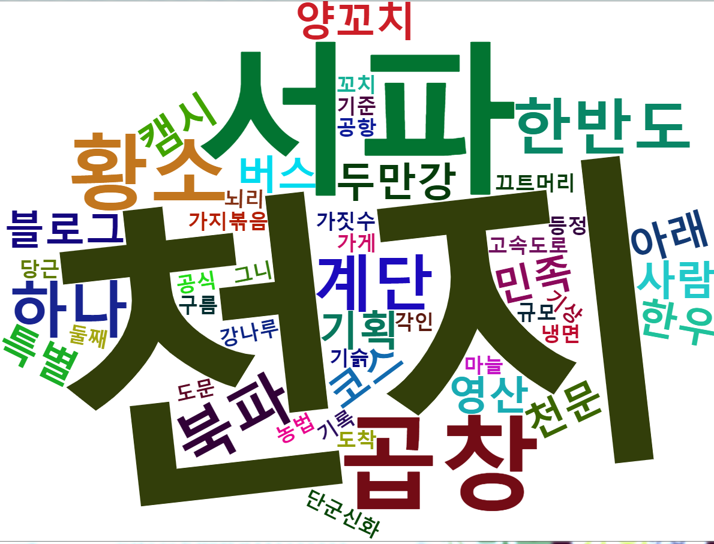

# R 수행평가 - 블로그 검색 API 워드클라우드


#R 스크래핑 Java연동 형태소 분석 결과 워드 클라우드로 시각화 

네이버 Open API 중 블러그 검색을 위한 API를 이용하여 
"백두산" 검색어로 
검색된 블로그 100개에 대해 첫 페이지부터 유사도순으로 정렬해 정보
(블러그 링크, 제목, 이름, 요약정보)를 받아 
형태소 분석을 수행하고, 워드 클라우드에 표현할 단어를 
빈도수 기준으로 상위 50개 단어 추출하여 워드 클라우드로 시각화 하시오


```r
#기본 URL
urlStr <- "https://openapi.naver.com/v1/search/blog.xml?"
#검색어 설정 및 UTF-8 URL 인코딩
searchString <- "query=백두산"
#UTF-8 인코딩
searchString <- iconv(searchString, to="UTF-8")
#URL 인코딩
searchString <- URLencode(searchString)
searchString

#나머지 요청 변수 : 조회 개수 100개, 시작페이지1, 유사도순 정렬
etcString <- "&dispaly=100&start=1&sort=sim"

#URL 조합
reqUrl <- paste(urlStr, searchString, etcString, sep="")
reqUrl

#get방식으로 URL을 호출하기 위해 httr 패키지의 GET함수 활용
library(httr)
clientID <- "V4He6PcfBx77CB7tQR44" 	#아이디나 비번은 개발자센터에서 신청해서 받으셈
clientSecret <- "LDRbcg4RYS"


#인증 정보는 add_headers에 담아 함께 전송
apiResult <- GET(reqUrl, add_headers("X-Naver-Client-Id"=clientID,
                                     "X-Naver-Client-Secret"=clientSecret))

apiResult #응답 코드 status가 200이면 정상

# OpenAPI의 결과 구조 확인 (UTF-8로 인코딩된 XML 형식)
str(apiResult) #XML 응답값은 "content"에 담겨있음.

apiResult$content
str(apiResult$content)

#raw형식이므로 rawToChar()를  활용해 문자로 변환
result <- rawToChar(apiResult$content)
result

#인코딩(한글깨짐 고쳐줌)
Encoding(result) <- "UTF-8"
result # 블로그 링크, 제목, 이름, 요약정보등을 제공


refinedStr <- result
#XML 태그를 공란으로 치환
refinedStr <- gsub("<\\/?)(\\w+)*([^<>]*)>", " ", refinedStr)
#단락을 표현하는 불필요한 문자를 공란으로 치환
refinedStr <- gsub("[[:punct:]]", " ", refinedStr)
#영어 소문자를 공란으로 치환
refinedStr <- gsub("[a-z]", " ", refinedStr)
#영어 대문자를 공란으로 치환
refinedStr <- gsub("[A-Z]", " ", refinedStr)
#숫자를 공란으로 치환
refinedStr <- gsub("[0-9]", " ", refinedStr)
#여러 공란은 한 개의 공란으로 변경
refinedStr <- gsub(" +", " ", refinedStr)

refinedStr 


library(KoNLP)
library(rJava)

nouns<- extractNoun( refinedStr )
str(nouns)
nouns[1:50]

#길이가 1인 문자를 제외
nouns <-nouns[nchar(nouns) > 1]

#제외할 특정 단어를 정의
excluNouns <- c("백두산", "^ㄷ^ㄷ", "달려달려", "더봄", "더시키고", "건너")
# ?? excluNouns <- c("코타키나발루", "얼마" , "오늘", "으로", "해서", "API", "저희", "정도")


nouns  <- nouns [!nouns  %in% excluNouns ]
nouns [1:50]

#빈도수 기준으로 상위 50개 단어 추출
wordT <- sort(table(nouns), decreasing=T)[1:50]
wordT

#wordcloud2 패키지 
# wordcloud2 (data, size, shape) 
# 단어와 빈도수 정보가 포함된 데이터프레임 또는 테이블, 글자 크기, 워드 클라우드의 전체 모양(circle:기본# 값, cardioid, diamond, triangle, star등)

library(wordcloud2)
wordcloud2(wordT, size=3, shape="diamond")


```


결과 : 




