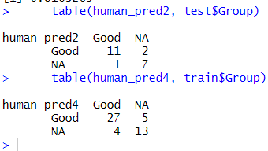

  \###############채용 인재의 특성 분석 #######################
의사결정나무(decision tree)는 목표변수에 대한 의사결정 규칙(Rule)들을 나무구조로 시각화하여 분류와 예측을 수행하는 기법으로 각종 데이터로부터 규칙을 도출하는데 활용되고 있는 방법

예제 데이터 : A회사에서 실시한 경력 사원 채용 시 인터뷰평가 결과 데이터
myhuman.csv

변수 : Sociability (사교성) , Rating(직장경력), Score(케이스 인터뷰 점수), Group(실제 입사한 경력사원의 성과평가그룹 - NA:우리회사에 적합하지 않은 인재, Good:우리회사에 적합한 우수인재)

```r
   #  분석 문제 :
 # 1. 학습데이터를 통해서 학습한 결과 우수인재(Good)와 부적합인재(NA)에 대한 예측빈도와 예측확률은?  
 # train 데이터의 예측 확률 : 0.8163265
     
 #   2. 학습데이터를 통해 학습한 결과 인재의 적합유무 분류판별에 대한 예측정확성은?
 #	0.8163265
    
 #   3. 학습데이터를 통해 분석한 결과 인재의 적합여부 분류판단에 중요하게 사용되는 변수와 임계기준치는?
 #	 score, 80점 
     
 #   4. 학습된 분류모델을 검정 데이터에 적용해 보고 우수인재(Good)와 부적합인재(NA)에 대한 예측빈도와 			예측확률은?
 #	 0.8095238
     
 #   5. 검정 데이터를 통해 분석한 결과 인재의 적합유무 분류판별에 대한 예측정확성은?
     #0.8095238
     
	#  	 6. 학습데이터의 예측정확성과 검정데이터의 예측정확성을 교차 테이블로 상호비교하시오
	#	 검정(test) : 0.8095238
	#  학습(train) : 0.8163265
```


```r
    data <- read.csv("./datas/myhuman.csv", header=TRUE)
    
    library(party)
    str(data)   
    
    formula <- Group ~ Sociability+Rating + Career +Score 
     
     #단계1 : 학습데이터와 검정 데이터 생성
     idx <- sample(1: nrow(data), nrow(data) * 0.7)
     train <- data[idx, ] # 학습데이터
     dim(train)
     test <- data[-idx, ] # 검정데이터
     dim(test)
     
     test
     
     #단계2 : formula 생성
     # 도시 성과평가 <- : Sociability (사교성) , Rating(직장경력), Score(케이스 인터뷰 점수)
     formula <- Group ~ Sociability+Rating + Career +Score 
     
     #단계3 : 학습데이터에 분류모델 적용
     human_train <- ctree(formula, data=train)
     #
     #단계4 : 검정데이터에 분류모델 적용
     human_test <- ctree(formula, data=test)
     

     #단계5 : 분류분석 결과 시각화
     plot(human_test)
     plot(human_train)
 
     
     혼돈행렬
     
     human.df <- rpart(Group ~ Sociability+Rating + Career +Score , data = data)
     plot(human.df)
     text(human.df, use.n=T, cex=0.7)
     
     
     human_pred <- predict(human.df , test)
     human_pred
     
     #y의 범주로 코딩 변환 : Good(0.5이상), NA(0.5미만)
     #rpart의 분류모델 예측치는 비 유무를 0~1사이의 확률값으로 예측하다 
     # 혼돈매트릭스를 이용하여 분류정확도를 구하기 위해 범주화 코딩 변경
     human_pred2 <- ifelse(human_pred[,1] >= 0.5, 'Good', 'NA')
     
     table(human_pred2, test$Group)
     
     (11 + 7) / nrow(test)
     #0.8095238
     
     
     human_pred3 <- predict(human.df , train)
     human_pred3
     human_pred4 <- ifelse(human_pred3[,1] >= 0.5, 'Good', 'NA')
     table(human_pred4, train$Group)
     
     
     (27 + 13) / nrow(train)
     #0.8163265
     
```


결과 : 


예측확률 검정 ( 테스트, 트레인 순)





학습데이터 트리 


